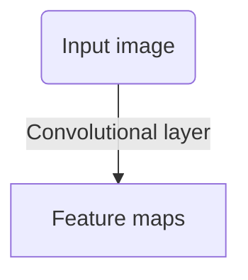

The layer that 'makes' a CNN. It consists of learnable filters that are applied to inputs at each location, i.e., the filters 'slide through' the input data, and the result is a feature map. The convolutional layer has parameters on number and size of filters, stride size and padding.

ChatGPT's visualization:

#### Compared to a fully-connected Dense layer
-Tän sais lyhyemminkin varmaan selitettyä-
Convolutional layers are designed to process 'spatially structured' data, such as images, whereas dense layers are desinged to process vector data. Although practically an image is also represented as a vector, the interpretation is different, since a convolutional layer captures the spatial relationship between each input feature, whereas a dense layer treats them independent from each other. This is because a convolutional layers share the same set of filters across all locations in the input, and so features are captured regardless of their spatial location. In contrast, a dense layer has separate set of weights for each input feature. 

Practical example: images of the sun: on the left and on the right. A convolutional layer should detect the sun in both images, whereas a dense layer will result in two different outputs.

