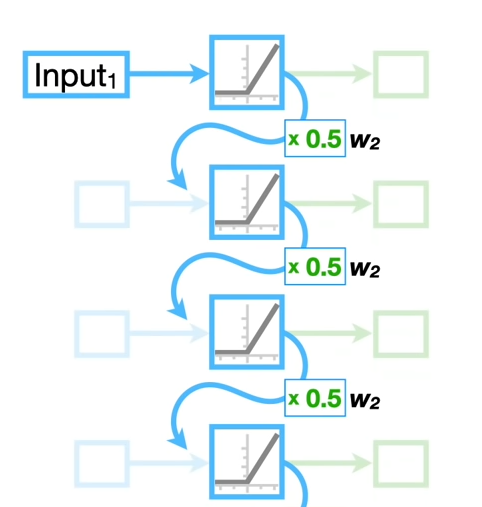

A RNN is used for sequential data, i.e., whenever a prediction needs to be based on a chain of historical events. For example, a certain idiom might be a chain of words, and for a NN to predict the last word of the idiom, the words before that (the context) is needed. This is achieved by chaining a series of recurrent layers, so that each layer is connected to the previous layer via a hidden state vector, which stores the previous state of the network. Thus, in a sense, the internal state of the previous layer can be thought as the summary of previous inputs up until that layer.

Mathematically, the hidden states and the output can be described as:

$h_t = \sigma(W_{xh} x_t + W_{hh} h_{t-1} + b)$

$y_t = W_{hy} h_t$

Where $h_t$ refers to the internal/hidden state at time step $t$, which comes from the sum of weighted sum of the input $x_t$, weighted sum of the internal previous state $h_{t-1}$ and a bias term $b$, and passing the sum through an activation function $\sigma$.
The $y_t$ is the output of the last layer ...

^ Above is an illustration (source: https://www.youtube.com/watch?v=AsNTP8Kwu80, cringe vid but good)
And at the last layer, the hidden state isn't passed forward anymore, but instead the network calculates the output $y_t$.

In a RNN, as in a CNN, the parameters (weights) are shared across the (recurrent) layers. Also, when training, a slightly different version of backpropagation is needed: backpropagation through time (BPTT). 

